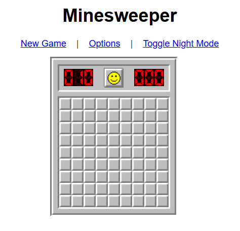

# Minesweeper

A classic implementation of the Minesweeper game, designed to run locally in any modern web browser. This project offers a clean, single-player experience with core Minesweeper features, refactored from an original minified codebase.

## Screenshot

*(You should replace `assets/screenshot.png` with an actual screenshot of your game. I've assumed you'd place it in the assets folder).*

## Features

*   **Classic Gameplay:** Reveal squares, flag mines, and try to clear the board!
*   **Multiple Difficulty Levels:**
    *   Beginner (9x9 grid, 10 mines)
    *   Intermediate (16x16 grid, 40 mines)
    *   Expert (30x16 grid, 99 mines)
    *   Custom (set your own grid dimensions and mine count via the "Options" menu)
*   **Game Interface:**
    *   Timer: Tracks your game duration.
    *   Mine Counter: Shows the number of mines left to flag (can be negative if over-flagged).
    *   Smiley Face: Reacts to game events (smile, ooh, dead, win).
*   **First-Click Safety:** Your first click in a new game is guaranteed not to be a mine, and the 3x3 area around it will also be cleared of mines.
*   **Undo Last Losing Move:** If you accidentally click a mine, press `Ctrl+Z` (or `Cmd+Z` on Mac) to revert to the state just before that move.
*   **Night Mode:** Toggle between "Toggle Night Mode" and "Toggle Light Mode" for comfortable viewing in different lighting conditions.
*   **Keyboard Shortcuts:**
    *   `F2`: Start a new game.
    *   `Spacebar`: Flag/unflag a square or perform a chord action (reveal neighbors) on an already revealed numbered square.
*   **Touch Controls:** Basic support for playing on touch-enabled devices (tap to reveal, long-press to flag).
*   **Purely Client-Side:** Runs entirely in your browser. No internet connection or server is needed after loading.
*   **Organized assets:** All image assets (sprites for game elements, flag icon) are located in the `assets/` folder.

## Technologies Used

*   HTML5
*   CSS3
*   JavaScript (ES5 style, refactored from an older minified codebase)
*   jQuery (version 1.12.4 for compatibility with original script's browser detection)
*   jQuery Migrate (version 1.4.1 to support `$.browser` functionality used by the original script)

## Setup and How to Run

1.  **Ensure Correct File Structure:**
    Make sure you have the following files and folder in the same directory:
    *   `index.html`
    *   `minesweeper.css`
    *   `minesweeper.js`
    *   `assets/` (folder containing `flag.png`, `sprite100.gif`, `sprite100-night.gif`, and your `screenshot.png`)

2.  **Open in Browser:**
    Simply open the `index.html` file in any modern web browser (e.g., Chrome, Firefox, Edge, Safari).

No build steps or local server are strictly required to run the game, as it's a static client-side application.

## How to Play

*   **Objective:** Uncover all the squares that do not contain mines without detonating any mines.
*   **Left Click:** Reveal a square.
    *   If it's a mine, the game is over (unless it's your first click).
    *   If it's a number, it indicates how many mines are adjacent (horizontally, vertically, or diagonally) to that square.
    *   If it's empty (a '0' which is visually blank), all adjacent empty squares (and their numbered neighbors) will be automatically revealed in a cascade.
*   **Right Click:** Place or remove a flag on a square you suspect contains a mine. This helps you keep track and also interacts with the chording feature.
*   **Middle Click (or Left+Right Click simultaneously) on a Revealed Number:** If the number of adjacent flagged squares matches the number on the revealed square, this action (called "chording") will reveal all other unflagged, unrevealed adjacent squares. This is a quick way to clear areas but be careful – if your flags are wrong, you might hit a mine!
*   **Winning:** You win when all non-mine squares are revealed. The game will automatically flag any remaining mines.
*   **Losing:** You lose if you click on a mine (after the first safe click).

## Project History

This project originated from a minified JavaScript file for a Minesweeper game. It has undergone significant refactoring to improve code readability and maintainability. Several features present in the original minified version, such as server-side high score submissions, import/export of game state, and UI zoom, have been removed to streamline it into a focused, local, single-player experience. CSS has also been cleaned up to remove styles for unused UI elements.

---

Remember to replace `assets/screenshot.png` with an actual path to a screenshot of your game if you decide to include one!