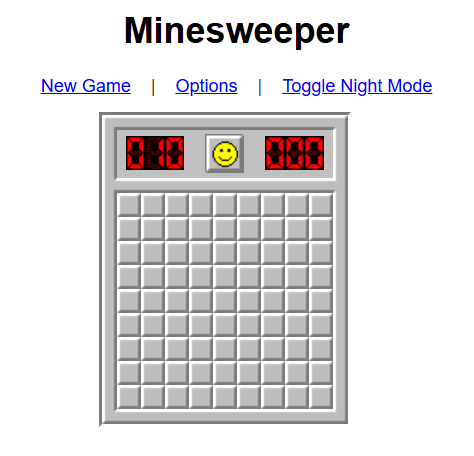

# Minesweeper

A classic implementation of the Minesweeper game, designed to run locally in any modern web browser. This project offers a clean, single-player experience with core Minesweeper features.

## Screenshot



## Features

This Minesweeper game provides the traditional gameplay experience where players reveal squares and flag potential mines. It includes a reactive smiley face icon, a mine counter, and a game timer.

Players can select from standard difficulties (Beginner, Intermediate, Expert) or create a **custom game** by defining the grid size and number of mines through the "Options" menu. A key user-friendly feature is **first-click safety**, ensuring the initial click never detonates a mine and clears the surrounding 3x3 area if it would have been a mine. For those moments of miscalculation, an **undo feature** (`Ctrl+Z` or `Cmd+Z`) allows players to revert their last losing move.

The game also offers a **Night Mode** for comfortable viewing, toggled via a dedicated link. Essential **keyboard shortcuts** like `F2` for a new game and `Spacebar` for flagging or chording are supported, alongside basic **touch controls** for mobile play. All game assets are neatly organized in the `src/assets/` folder. The entire game runs client-side, requiring no internet connection after initial loading.

## Technologies Used

*   HTML5
*   CSS3
*   JavaScript (ES5 style)
*   jQuery (version 1.12.4)
*   jQuery Migrate (version 1.4.1)

## Setup and How to Run

1.  **Ensure Correct File Structure:**
    All game files are located within the `src/` directory. The expected structure is:
    ```
    minesweeper-project-root/
    ├── src/
    │   ├── index.html
    │   ├── minesweeper.css
    │   ├── minesweeper.js
    │   └── assets/
    │       ├── flag.png
    │       ├── sprite100.gif
    │       ├── sprite100-night.gif
    │       └── screenshot.png
    └── README.md 
    ```

2.  **Open in Browser:**
    Navigate to the `src/` directory and open the `index.html` file in any modern web browser (e.g., Chrome, Firefox, Edge, Safari).

No build steps or local server are strictly required to run the game.

## How to Play

The goal is to uncover all squares that do not contain mines without detonating any.

*   **Left Click:** Reveals a square. A number indicates adjacent mines. An empty square (a '0') cascades to reveal other empty and numbered squares.
*   **Right Click:** Places or removes a flag on a suspected mine.
*   **Middle Click (or Left+Right Click simultaneously) on a Revealed Number:** If the number of adjacent flags matches the square's number, this "chording" action reveals remaining adjacent unflagged squares.
*   **Winning:** Occurs when all non-mine squares are revealed.
*   **Losing:** Occurs if a mine is clicked (after the first safe click).